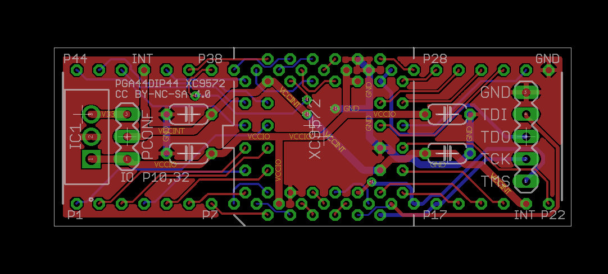
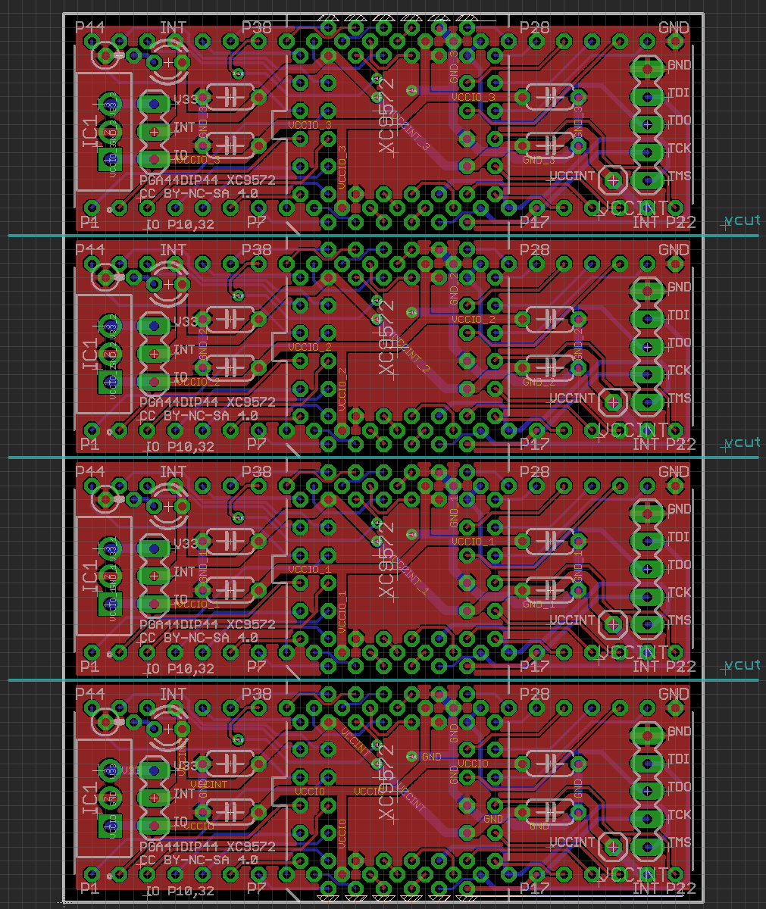
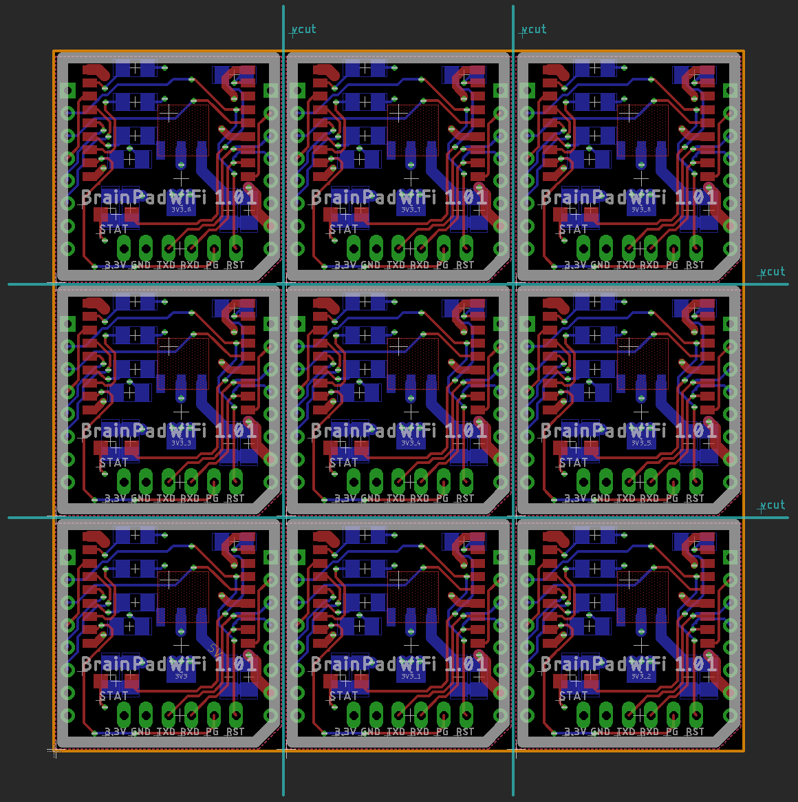

# EAGLE CAD artwork panelizer

## What is this?

* This is simple tool for panelize EAGLE CAD artwork.
* [Motivates from this tweets](https://twitter.com/kekyo2/status/852850454740353024) "Specify X, Y on the EAGLE just make faces with Gerber in 1 shot."

## Download binary

* [Released 1.1 (for .NET 4.5 binary)](https://github.com/kekyo/EaglePanelizer/releases/download/1.1/EaglePanelizer-1.1.zip)

## Example

* Original artwork (*.brd file)



* Apply this tool then:



## How to use

* You can see the help without some arguments:
  * Width and height units are milli-meter.

```shell
D:\PROJECT\EAGLE\BrainPadWiFi>EaglePanelizer.exe --help
EaglePanelizer - EAGLE CAD artwork panelizer 1.2
Copyright (c) 2017-2018 Kouji Matsui (@kozy_kekyo)

usage: EaglePanelizer [--dimension-layer=<value>] [--help] [--line-width=<value>] [--vcut-indicator] [--vcut-layer=<value>] [--vcut-post-length=<value>] <target-width> <target-height> <from-path> <panelized-path>
 -d, --dimension-layer=<value>  Force set layer number for dimension (contour)
 -h, --help                     Show this help
     --line-width=<value>       Dimension contour and V-Cut line width
 -i, --vcut-indicator           Draw 'V-Cut' indicator
 -v, --vcut-layer=<value>       Force set layer number for V-Cut lines
 -p, --vcut-post-length=<value> V-Cut line post length
```

* Example: With draw V-Cut indicator.

```shell
D:\PROJECT\EAGLE\BrainPadWiFi>EaglePanelizer.exe --vcut-indicator 100 100 BrainPadWiFi.brd panelized.brd
EaglePanelizer - EAGLE CAD artwork panelizer 1.2
Copyright (c) 2017-2018 Kouji Matsui (@kozy_kekyo)

Original board: Size=(25.908, 26.289), (0, 0) - (25.908, 26.289)
Dup[1]: (25.908, 0)
Dup[2]: (51.816, 0)
Dup[3]: (0, 26.289)
Dup[4]: (25.908, 26.289)
Dup[5]: (51.816, 26.289)
Dup[6]: (0, 52.578)
Dup[7]: (25.908, 52.578)
Dup[8]: (51.816, 52.578)
Totally panelized: Count=9, Size=(77.724, 78.867), (0, 0) - (77.724, 78.867)
```

* And got result:



## License

* Source code copyright (c) 2017-2018 Kouji Matsui (@kozy_kekyo)
* Under Apache v2 http://www.apache.org/licenses/LICENSE-2.0

## History

* 1.2:
  * Separated contour lines and V-Cut lines.
  * Draw V-Cut indicator.
  * Support complex command-line arguments.
* 1.1:
  * Calculate contour with package's.
  * Added usage help.
  * Support .NET Core 2.0.
  * Upgraded to MSBuild 2.0.
* 1.0:
  * First public release.
