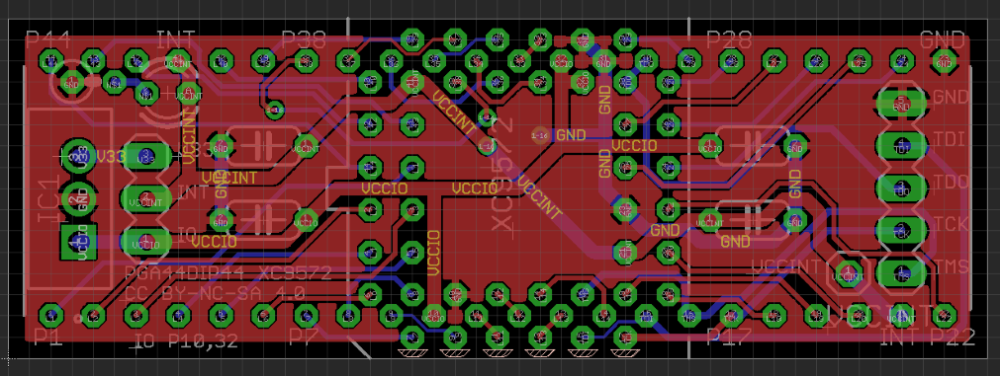

# EAGLE CAD artwork panelizer

## What is this?

* This is simple tool for panelize EAGLE CAD artwork.
* [Motivates from this tweets](https://twitter.com/kekyo2/status/852850454740353024) "Specify X, Y on the EAGLE just make faces with Gerber in 1 shot."

## Example

* Original artwork (*.brd file)

* Apply this tool then:

## How to use

TODO:

## License
* Copyright (c) 2017 Kouji Matsui
* Under Apache v2 http://www.apache.org/licenses/LICENSE-2.0
